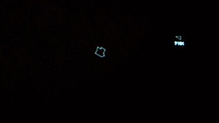
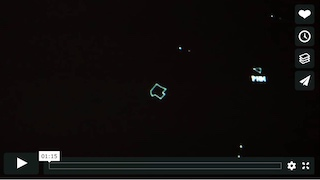

# Elixoids

[Asteroids][1] game engine written in [Elixir][2].

[][6] [][6]


The UI is rendered by [asteroids-ui][3]. Audio provided by [SonicAsteroids][4].

Watch the [Elixoids movie][6] on [Vimeo](https://vimeo.com) recorded at a Coding Night. Participants were given one hour to write an AI bot that could pilot a ship and play the game! See the original [Arcade Asteroids video](https://www.youtube.com/watch?v=WYSupJ5r2zo).

Master: [](https://travis-ci.org/devstopfix/elixoids) Stable v1: [](https://travis-ci.org/devstopfix/elixoids)


# Build

There are two versions of this game, v3 on master, and v1 which was released in 2016. To run the game on OSX:

    brew install elixir
    git clone https://github.com/devstopfix/elixoids.git
    cd elixoids
    mix deps.get

Branch [v1](//github.com/devstopfix/elixoids/tree/v1) contains the version compatible with the UI and original [Sonic][4] repositories.

# Run

This repo contains the game engine, a webserver, and a recent version of the [asteroids-ui][3].

To start a game:

    mix run --no-halt

or a REPL:

    iex -S mix

Open the UI in your browser:

    open http://localhost:8065/game/index.html

The game runs well in full screen, on Chrome this can be enabled with `[cmd]-[↩]`

To hear the sound effects on a Mac, download and run [v3 of the SonicAsteroids.app][7] and set the address to listen to as:

    ws://localhost:8065/0/sound

See the protocol below.

## Clients

Clients subscribe to an event stream from the game via Websockets.

### Sound Client Protocol

Sound events can be received at `ws://example.com/0/sound` and here is the [sound format](docs/sound_protocol.md).

### News Client

There is a sample Python news client at [cat_news.py](client/cat_news.py):

The news stream is a stream of lines of the form:

    [PLAYER|ASTEROID] VERB [PLAYER|ASTEROID]

Examples:

```
PLY fires
PLY shot ASTEROID
PLY kills OTH
ASTEROID hit PLY
```

### Java Ship Client

See [Elixoids Java Client](https://github.com/jrothwell/asteroids-client) by [J Rothwell][5].

### Python Asteroid Miner Client

The [CBDR](https://en.wikipedia.org/wiki/Constant_bearing,_decreasing_range) Python client at [miner.py](client/miner.py) will try and shoot the asteroid which is on the most constant bearing with it:

    pip3 install websocket-client
    python3 clients/miner.py --host localhost:8065 --name MCB

### Ruby Clients

There are some sample clients, written in Ruby, in the [clients](clients) folder. They require two libraries (which may require *sudo* depending on your Ruby installation):

    gem install eventmachine
    gem install faye-websocket

    gem list --local

To run a simple client that instructs a ship to [shoot the nearest asteroid](clients/client_shoot_nearest_rock.rb):

    ruby clients/client_shoot_nearest_rock.rb

If you are running the game other than at localhost, specify the websocket in the environment:

    export ELIXOIDS_SERVER=rocks.example.com:8065

NB The websocket library is troublesome. It will often fail to connect after a reboot. Keep trying and it will eventually connect and stay connected! These scripts will be migrated to Python3.

## Refresh UI

In order to get the latest version of the UI:

* checkout [asteroids-ui][3] in a sibling folder to this project
* rebuild:

```bash
cd asteroids-ui/asteroids-renderer
npm run build
````

Copy the artefacts into the local folder which is served by the game webserver:

    cp asteroids-ui/asteroids-renderer/bin/* elixoids/priv/html/

## Deploy

See the [Ubuntu deployment guide](docs/ubuntu.md) to run the game engine on a server.

## Licence

This software is published under the [MIT License](LICENSE) and Copyright ©2019 [devstopfix](https://www.devstopfix.com). UI is ©2016 [lachok](https://github.com/lachok). Audio code is ©2016 [jrothwell][5].


[1]: https://en.wikipedia.org/wiki/Asteroids_(video_game)
[2]: http://elixir-lang.org/
[3]: https://github.com/lachok/asteroids
[4]: https://github.com/jrothwell/sonic-asteroids
[5]: https://github.com/jrothwell
[6]: https://vimeo.com/330017229
[7]: https://github.com/devstopfix/sonic-asteroids/releases/tag/v3.19.118